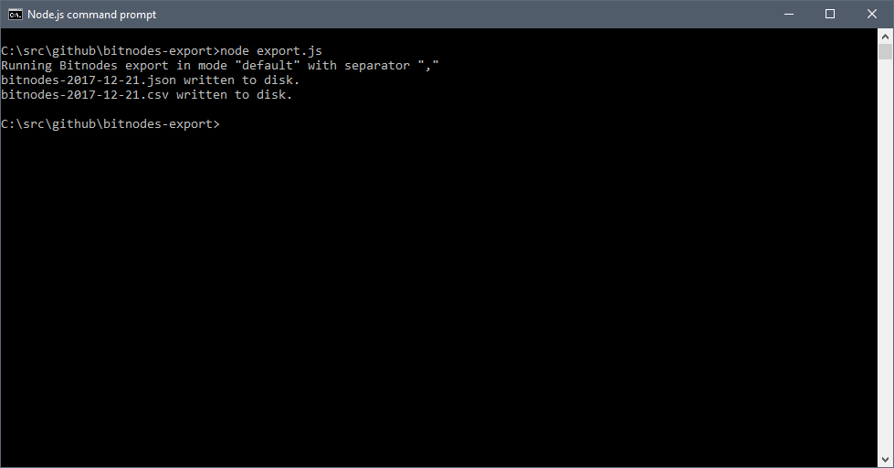
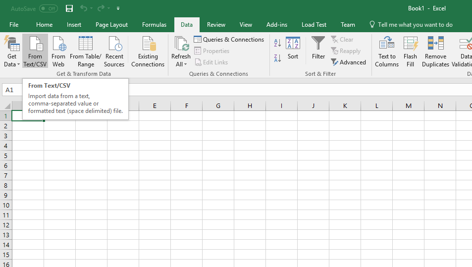
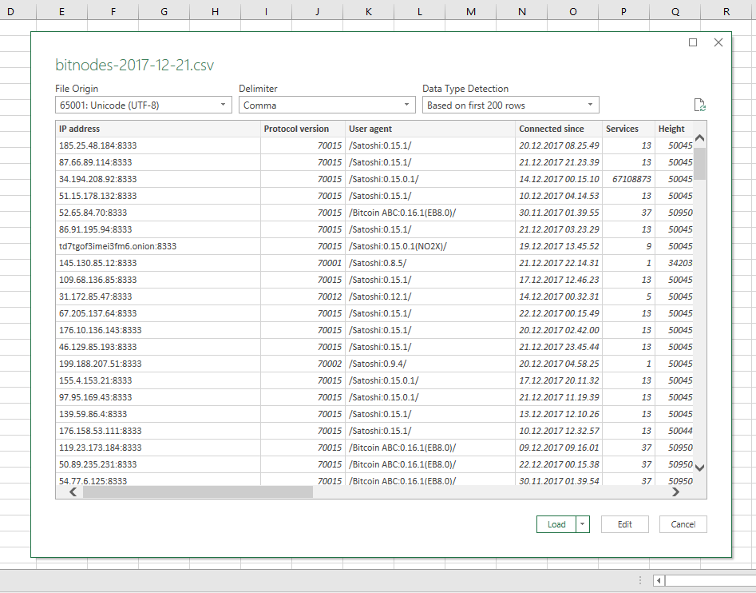
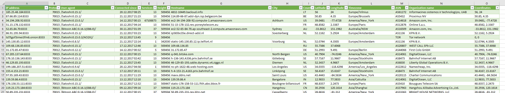

# bitnodes-export
Node.js script that converts Bitnodes JSON into CSV format easily imported to Excel.

```sh
node export.js
```

[Bitnodes](https://bitnodes.earn.com/) is an excellent service that lists all public accessible Bitcoin nodes. The search engine built into Bitnodes is limited, so an option is to import data into Microsoft Excel, which has better features for search, filtering, graphs and more.

Unfortunately the format is not 100% compatible with the Data import in Microsoft Excel, due to "null" values.

This little script will take the latest list of nodes from Bitnodes, download it and translate it to a comma-separated values (CSV) file.

Script is built to only require Node.js and nothing else. Do not use this for other CSV needs, consider checking out one of the many CSV packages available. This script will not handle all possible cases of escaping characters, etc. that is needed for full CSV parsing. This is only for Bitnode export.

## How to use

1. Install [Node.js](https://nodejs.org/).
2. Download the "[export.js](export.js)" file to your local computer, put it in any folder on your computer.
3. Open "Node.js command prompt" (on Windows, e.g. Bash on macOS/Linux) and navigate to folder where you saved the export.js.
4. Run command: "node export.js". Two files should be written into the folder: bitnodes-2017-12-21.json and bitnodes-2017-12-21.csv.

The script supports 2 command parameter, first parameter can be "save" or "parse". By default without any parameters, the script will save two files, the "save" parameter will only save the JSON, and the "parse" parameter will only save the CSV.

The second parameter is what character you want to use as delimiter in the CSV file. By default, it is colon (","), but you can make it anything. This is available as an option, as Excel works differently across cultures and colon might not work for all. If certain characters such as " exists in the export, it will be removed to avoid CSV parsing issue.

Example with parameters:

```sh
node export.js parse |
node export.js default ;
node export.js save
```

## Screenshots

1. Run the export.js using node in console/bash.


2. Choose the Data/Import CSV and pick the exported .csv file.


3. Pick UTF-8 as format and verify data being imported.


4. Data available in Excel, now you can filter, sort, create pivot tables and charts.


## References

Bitnodes API: https://bitnodes.earn.com/api/

## Versions

### 0.2 (2017-12-22)
- Adds date formatting for "Connected since" column. 
- Adds a separate "Coordinates" column, which can quickly be pasted into any map tools to show pins.

### 0.1 (2017-12-21)
- Initial release.

## License

This is free and unencumbered software released into the public domain.

Read the [license](LICENSE).
